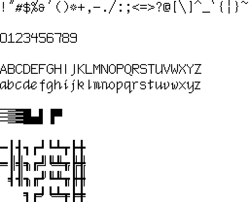
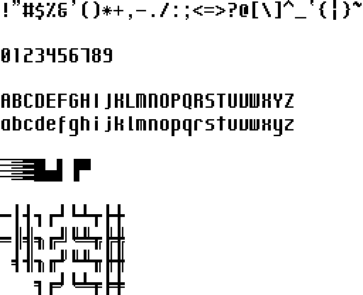

# System Adjacent:
### A revival of the Twiggy Macintosh prototype fonts, redesigned for programmers.
##### This is a Work in Progress. Expect changes whenever I feel like it.

If you're in this repository, you've probably used the original Macintosh or are interested in it. However, if you go a little bit further back to the Macintosh prototypes, you can uncover what I think are some of the prettiest computer fonts. I have two issues with those fonts, however: Firstly, they are somewhat inconsistent. Secondly, they're not very usable for programmers because they're proportional fonts, not monospaced. I've done my best to modify these to my taste while still maintaining the same feel as the originals. These fonts were created and edited with BitsNPicas.

Cream:

Chicago:

